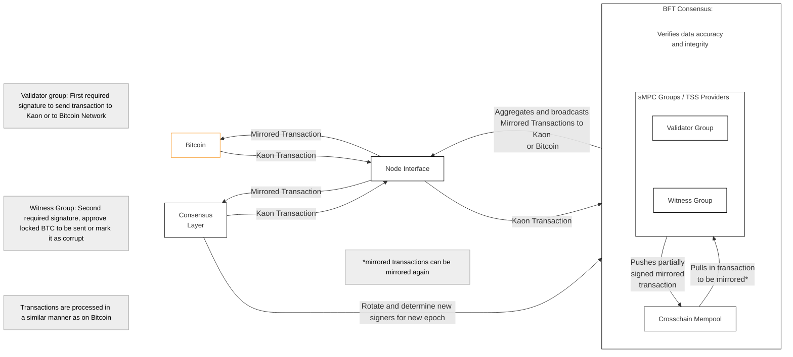

```mermaid
flowchart RL
 subgraph s3[" "]
    direction TB
        BTC["Bitcoin"]
        CL["Consensus<br /> Layer"]
 end
 style BTC fill:transparent,stroke:#F7931A,font-family:Arial,font-size:14px
 style CL fill:transparent,stroke:#000000,font-family:Arial,font-size:14px
 style s3 fill:transparent,stroke-width:0px,font-family:Arial

 subgraph s4[" "]
    direction TB
         NI["Node Interface"]
 end
 style NI fill:none,stroke:#000000,font-family:Arial,font-size:14px
 style s4 fill:none,stroke-width:0px,font-family:Arial

 subgraph s1["BFT Consensus:"]
    direction TB
        n4["Crosschain Mempool"]
        s2
        n1["Verifies data accuracy<br> and integrity"]
  end
 style s1 fill:none,stroke:#000000,font-family:Arial,font-size:14px
 style n4 fill:none,stroke:#000000,font-family:Arial,font-size:14px
 style s2 fill:none,stroke:#000000,font-family:Arial,font-size:14px
 style n1 fill:none,stroke:#000000,font-family:Arial,font-size:14px

 subgraph s2["sMPC Groups / TSS Providers"]
    direction TB
        n3["Witness Group"]
        n2["Validator Group"]
 end
 style s2 fill:none,stroke:#000000,font-family:Arial,font-size:14px
 style n3 fill:none,stroke:#000000,font-family:Arial,font-size:14px
 style n2 fill:none,stroke:#000000,font-family:Arial,font-size:14px

    t1["*mirrored transactions can be mirrored again"]
    t2["Validator group: First required signature to send transaction to Kaon or to Bitcoin Network"]
    t3["Witness Group: Second required signature, approve locked BTC to be sent or mark it as corrupt"]
    t4["Transactions are processed in a similar manner as on Bitcoin"]
    
    s3 ~~~ s4 ~~~ s1
    n2 ~~~ n3
    n1 ~~~ s2
    CL -- Kaon Transaction --> NI
    BTC -- Kaon Transaction --> NI
    NI -- Mirrored Transaction --> CL
    NI -- Mirrored Transaction --> BTC
    CL -- Rotate and determine new signers for new epoch --> s1
    NI -- Kaon Transaction --> s1
    s1 -- Aggregates and broadcasts<br /> Mirrored Transactions to Kaon<br /> or Bitcoin --> NI
    n4 -- Pulls in transaction<br /> to be mirrored* --> s2
    s2 -- Pushes partially<br /> signed mirrored<br /> transaction --> n4
    s1 ~~~ t1
    CL ~~~ t2
    CL ~~~ t3
    CL ~~~ t4

    style n1 stroke-width:0px,fill:transparent,font-family:Arial
    style s3 stroke-width:0px,fill:transparent,font-family:Arial

    t1:::Ash
    t2:::Ash
    t3:::Ash
    t4:::Ash
    classDef Ash stroke-width:1px, stroke-dasharray:none, stroke:#999999, fill:#EEEEEE, color:#000000, font-family:Arial, font-size:14px
```
