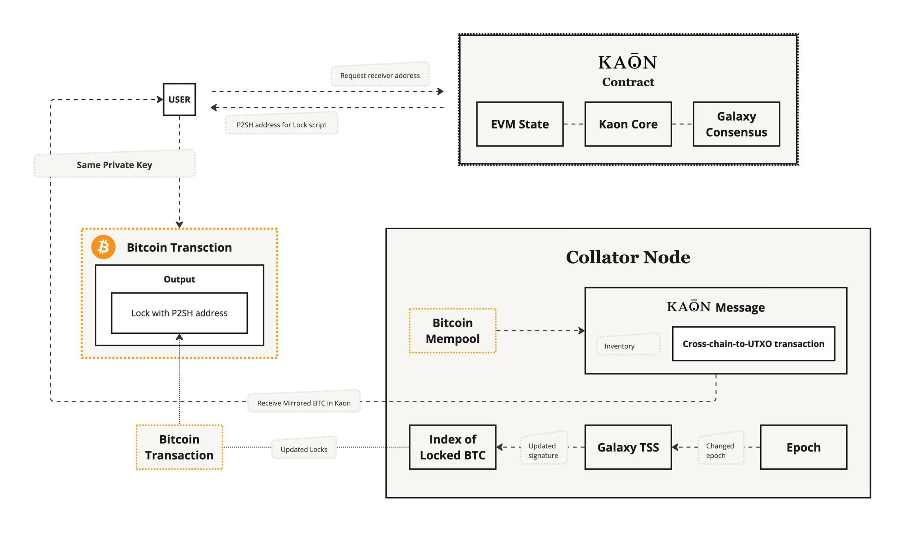

# BTC Withdrawal

<figure><figcaption></figcaption></figure>

1. User sends tokens to the contract where they initially received the P2PSH lock.
2. Ensure the sender is the native BTC sender.
3. If using a MetaMask address, specify the receiver; otherwise, the transaction will be rejected.
4. A P2PKH output is created.
5. The BTC is sent back to the user through a TSS signed transaction, completing the withdrawal process.
6. Contract verifies the voucher and then destroys it to prevent reuse.
