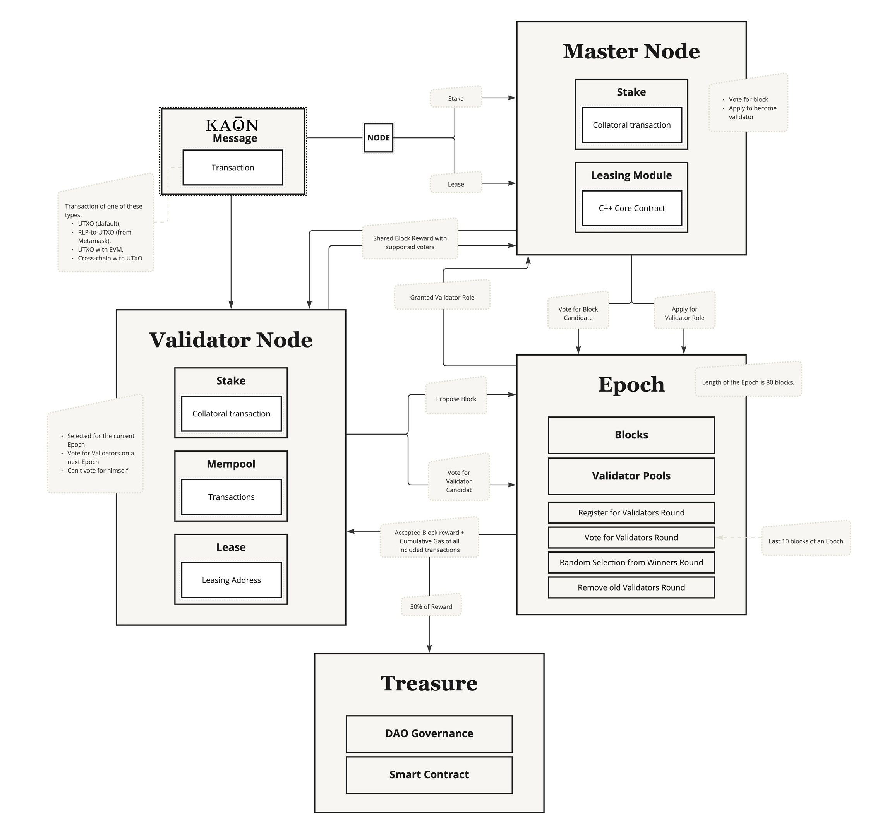

# Kaon Chain Consensus (dPoS)

Kaon Chain employs a Delegated Proof of Stake (dPoS) consensus mechanism, a Bitcoin-family consensus model based on stakes and delegates. This forms a two-level network comprising Master Nodes, Validators, and other nodes. Our implementation extends the traditional model to manage whitelists for Galaxy consensus.

<figure><figcaption></figcaption></figure>

1. **Epochs and Super-Cycles**:
   * An Epoch consists of 80 blocks (this number is subject to change).
   * Kaon uses Epochs and super-cycles to structure its blockchain operations.
2. **Master Nodes and Validator Candidates**:
   * Master Nodes can apply to become Validator Candidates starting from block 0 of the Epoch up to block 69.
   * From block 70 to block 80, current Validators vote for Validator Candidates for the next round of validators.
   * A Validator cannot apply to be a Validator Candidate and cannot be voted for during the Public Vote step.
3. **Validator Rotation**:
   * At the end of each Epoch, there is a rotation of validators.
   * Old validators are removed from the Validators Pool.
   * New Validators are randomly selected from the top-voted candidates of the Voting step.
4. **Reward Distribution**:
   * The consensus mechanism is responsible for distributing rewards.
   * The reward for a block consists of two parts:
     * A base part, which depends on the block height (Kaon has a modified halving algorithm).
     * The cumulative spent gas of all transactions included in the block.
5. **Recipients of Rewards**:
   * The Validator who proposed the accepted block.
   * Master Nodes that voted by placing their stakes on the block.
   * 30% of the reward is allocated to the Treasury.
