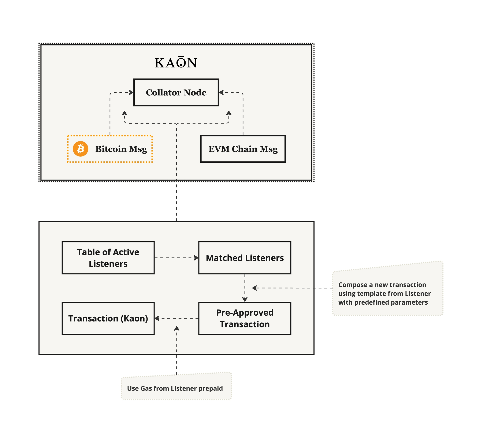

# Bridge-less ERC cross-chain Transfers

In Kaon, we have designed a system that facilitates secure and efficient cross-chain transfers without the need for intermediary bridges. This process is managed by specialized listeners and a set of clearly defined steps.

### The Listeners

<figure><figcaption></figcaption></figure>

* **Monitoring**: The listener continuously monitors incoming messages and transactions.
* **Expected Parameters**: It holds the expected parameters of incoming transactions from the Bitcoin Network or other chains.
* **Lifespan and Gas**: The listener has a defined gas amount that determines its lifespan, which can be refilled as necessary.
* **Triggering**: When triggered, the listener creates a new UTXO transaction in Kaon using parameters from both its creation and the incoming transaction, utilizing its stored gas as the transaction fee.

### Locks and Vouchers

<figure><figcaption></figcaption></figure>

* **Collator Mempool**: The new EVM transaction is added to the EVM chain part’s mempool by the collator nodes.
* **Triggering the Listener**: The listener is triggered based on parameter recognition and verification.
* **Token Lock Handling**:
  * If the transaction involves a token lock (indicating liquidity entering the chain from outside), a voucher (NFT) is created to identify the exact lock.
* **Token Unlock Handling**:
  * If the transaction involves token unlocking, the corresponding voucher is detected and destroyed.
* **Transaction Composition and Signing**: The transaction is composed and signed using the Threshold Signature Scheme (TSS).
* **ERC Token Exchange**: The voucher is subsequently exchanged for the corresponding ERC tokens.
* **Transaction Acceptance**: The final step ensures the acceptance and validation of the transaction, completing the cross-chain transfer process.
