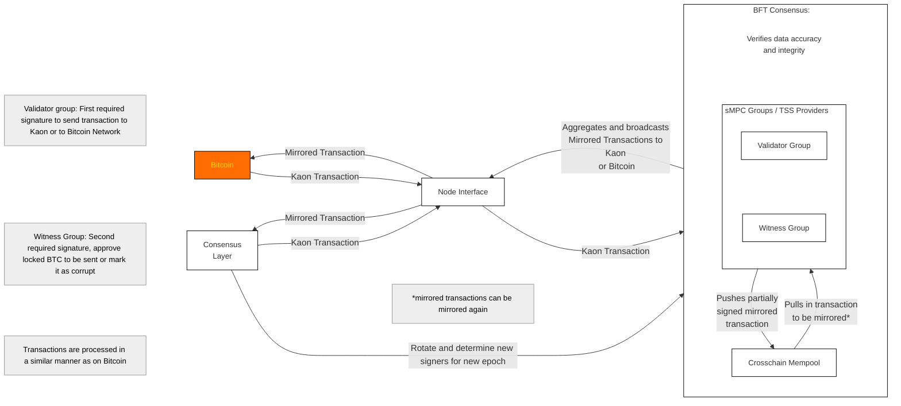
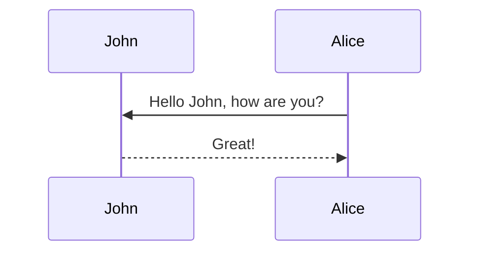
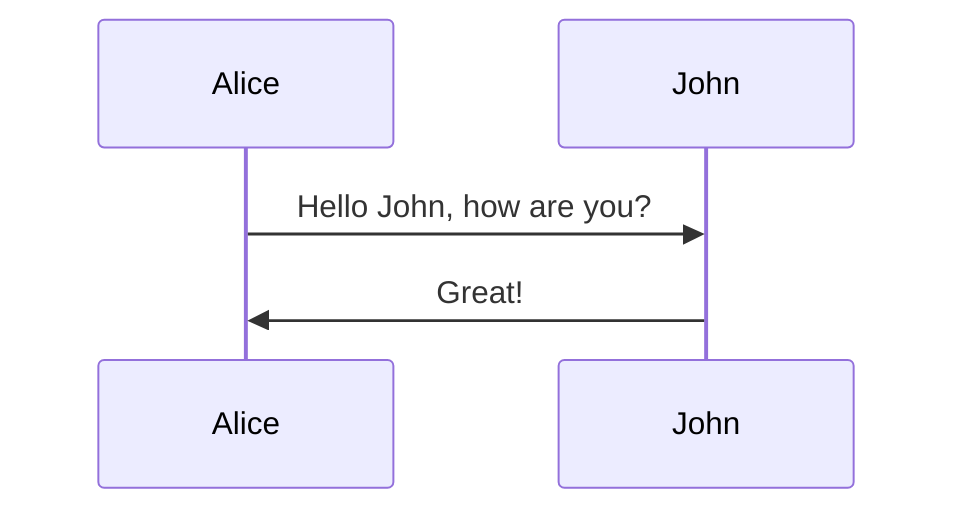
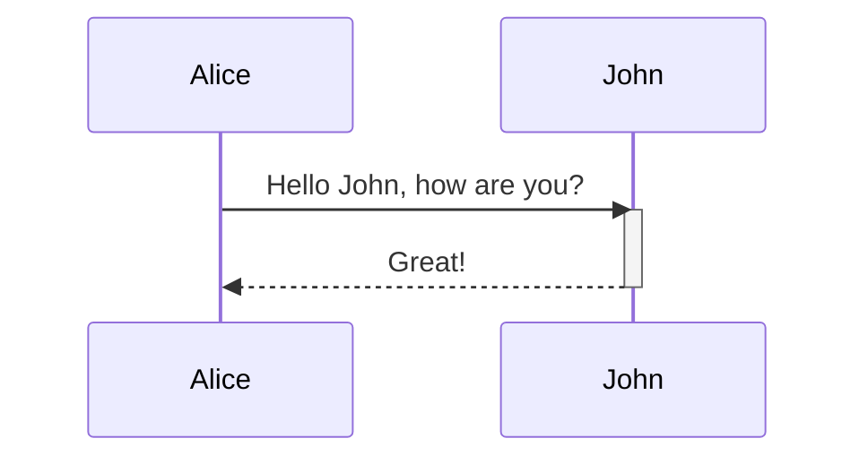
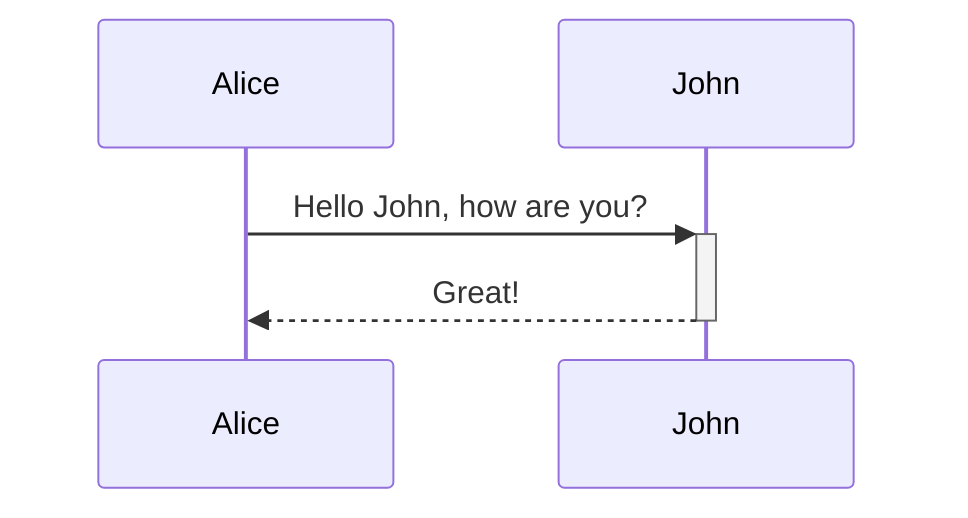
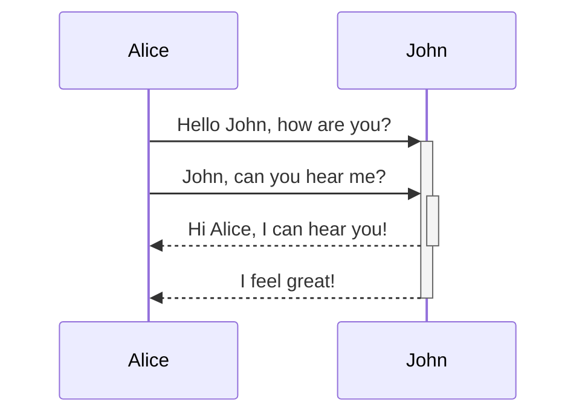
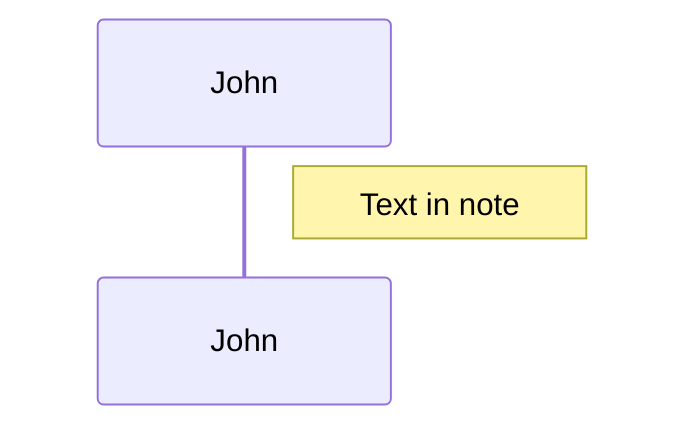
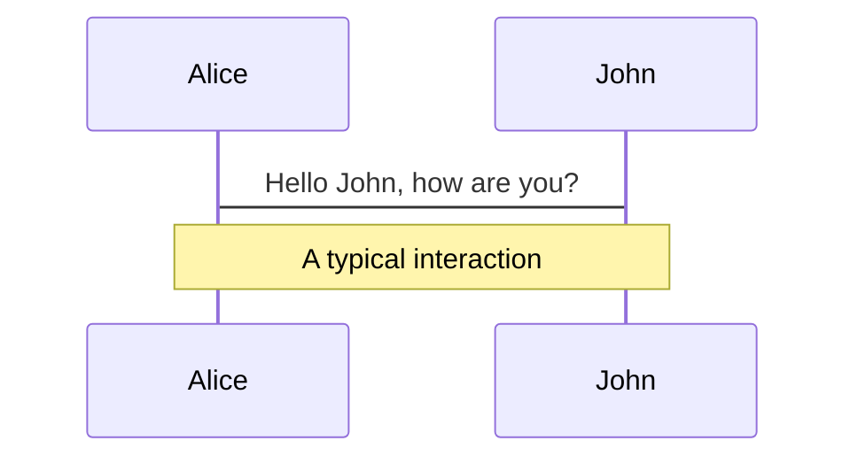
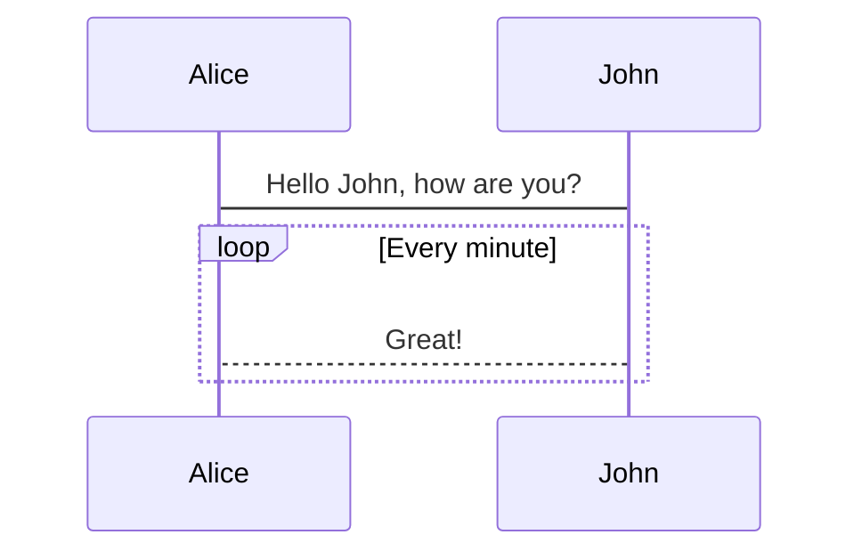
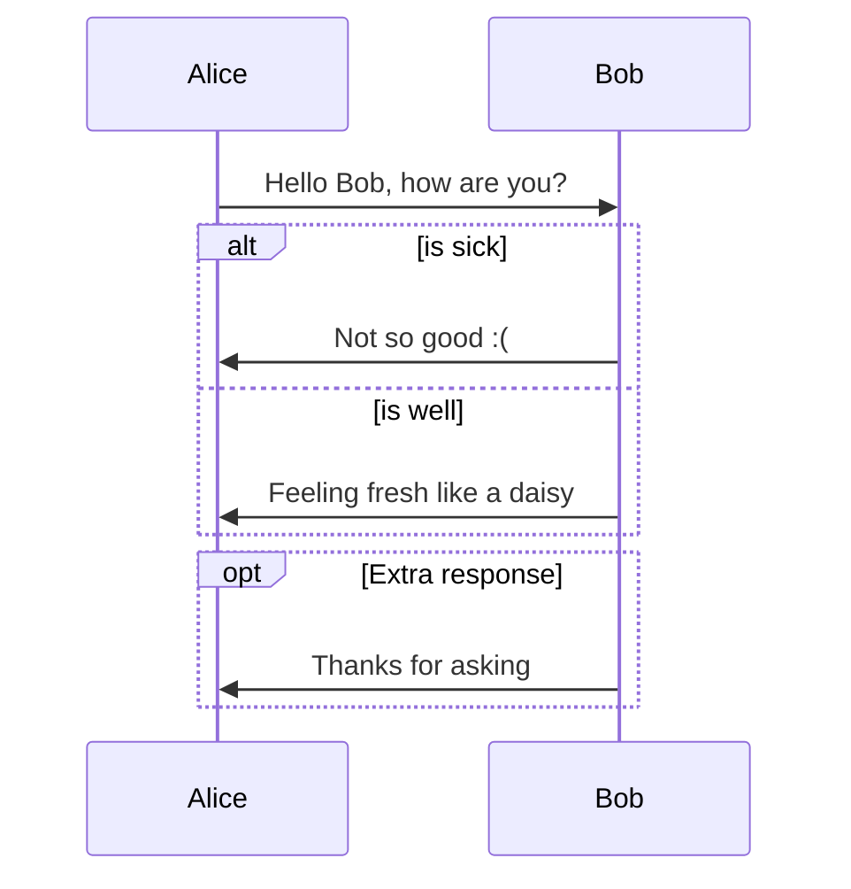

# Architecture View

> A Sequence diagram is an interaction diagram that shows how processes operate with one another and in what order.

Mermaid can render sequence diagrams.



## Syntax

### Participants

The participants can be defined implicitly as in the first example on this page. The participants or actors are rendered in order of appearance in the diagram source text. Sometimes you might want to show the participants in a different order than how they appear in the first message. It is possible to specify the actor's order of appearance by doing the following:



### Aliases

The actor can have a convenient identifier and a descriptive label.



## Messages

Messages can be of two displayed either solid or with a dotted line.

```
[Actor][Arrow][Actor]:Message text
```

There are six types of arrows currently supported:

| Type | Description                                 |
| ---- | ------------------------------------------- |
| ->   | Solid line without arrow                    |
| -->  | Dotted line without arrow                   |
| ->>  | Solid line with arrowhead                   |
| -->> | Dotted line with arrowhead                  |
| -x   | Solid line with a cross at the end (async)  |
| --x  | Dotted line with a cross at the end (async) |

## Activations

It is possible to activate and deactivate an actor. (de)activation can be dedicated declarations:



There is also a shortcut notation by appending `+`/`-` suffix to the message arrow:



Activations can be stacked for same actor:



## Notes

It is possible to add notes to a sequence diagram. This is done by the notation Note \[ right of | left of | over ] \[Actor]: Text in note content

See the example below:



It is also possible to create notes spanning two participants:



## Loops

It is possible to express loops in a sequence diagram. This is done by the notation

```
loop Loop text
... statements ...
end
```

See the example below:



## Alt

It is possible to express alternative paths in a sequence diagram. This is done by the notation

```
alt Describing text
... statements ...
else
... statements ...
end
```

or if there is sequence that is optional (if without else).

```
opt Describing text
... statements ...
end
```

See the example below:



## Styling

Styling of the a sequence diagram is done by defining a number of css classes. During rendering these classes are extracted from the

### Classes used

| Class        | Description                                                 |
| ------------ | ----------------------------------------------------------- |
| actor        | Style for the actor box at the top of the diagram.          |
| text.actor   | Styles for text in the actor box at the top of the diagram. |
| actor-line   | The vertical line for an actor.                             |
| messageLine0 | Styles for the solid message line.                          |
| messageLine1 | Styles for the dotted message line.                         |
| messageText  | Defines styles for the text on the message arrows.          |
| labelBox     | Defines styles label to left in a loop.                     |
| labelText    | Styles for the text in label for loops.                     |
| loopText     | Styles for the text in the loop box.                        |
| loopLine     | Defines styles for the lines in the loop box.               |
| note         | Styles for the note box.                                    |
| noteText     | Styles for the text on in the note boxes.                   |

### Sample stylesheet

```css
body {
    background: white;
}

.actor {
    stroke: #CCCCFF;
    fill: #ECECFF;
}
text.actor {
    fill:black;
    stroke:none;
    font-family: Helvetica;
}

.actor-line {
    stroke:grey;
}

.messageLine0 {
    stroke-width:1.5;
    stroke-dasharray: "2 2";
    marker-end:"url(#arrowhead)";
    stroke:black;
}

.messageLine1 {
    stroke-width:1.5;
    stroke-dasharray: "2 2";
    stroke:black;
}

#arrowhead {
    fill:black;

}

.messageText {
    fill:black;
    stroke:none;
    font-family: 'trebuchet ms', verdana, arial;
    font-size:14px;
}

.labelBox {
    stroke: #CCCCFF;
    fill: #ECECFF;
}

.labelText {
    fill:black;
    stroke:none;
    font-family: 'trebuchet ms', verdana, arial;
}

.loopText {
    fill:black;
    stroke:none;
    font-family: 'trebuchet ms', verdana, arial;
}

.loopLine {
    stroke-width:2;
    stroke-dasharray: "2 2";
    marker-end:"url(#arrowhead)";
    stroke: #CCCCFF;
}

.note {
    stroke: #decc93;
    stroke: #CCCCFF;
    fill: #fff5ad;
}

.noteText {
    fill:black;
    stroke:none;
    font-family: 'trebuchet ms', verdana, arial;
    font-size:14px;
}
```

## Configuration

Is it possible to adjust the margins for rendering the sequence diagram.

This is done by defining `mermaid.sequenceConfig` or by the CLI to use a json file with the configuration. How to use the CLI is described in the [mermaidCLI](mermaidCLI.html) page. `mermaid.sequenceConfig` can be set to a JSON string with config parameters or the corresponding object.

```javascript
mermaid.sequenceConfig = {
    diagramMarginX:50,
    diagramMarginY:10,
    boxTextMargin:5,
    noteMargin:10,
    messageMargin:35,
    mirrorActors:true
};
```

### Possible configuration params:

| Param           | Description                                                                                                                                 | Default value |
| --------------- | ------------------------------------------------------------------------------------------------------------------------------------------- | ------------- |
| mirrorActor     | Turns on/off the rendering of actors below the diagram as well as above it                                                                  | false         |
| bottomMarginAdj | Adjusts how far down the graph ended. Wide borders styles with css could generate unwantewd clipping which is why this config param exists. | 1             |
