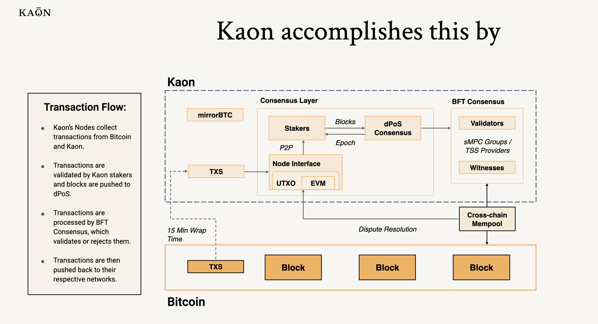

# How does it work?

At its heart, Kaon is unique because it operates natively as a Bitcoin protocol system while enabling full Ethereum Virtual Machine (EVM) capabilities. Imagine creating a bridge between Bitcoin's security model and Ethereum's programmability - _**but without actually using a bridge**_.

<figure><figcaption></figcaption></figure>

Kaon was developed from the ground up based on three key innovations:

1. **mirrorBTC**: Instead of wrapping Bitcoin, Kaon creates an exact mirror of it within its system. This means you can track precisely which Bitcoin you own - something not possible with wrapped Bitcoin solutions.
2. **Dual Nature**: Kaon nodes speak both Bitcoin and Ethereum natively. They can process Bitcoin's UTXO transactions and Ethereum's smart contracts simultaneously, with no translation layer in between.
3. **Two-Layer Consensus**:
   * A delegated Proof of Stake (dPoS) system manages the blockchain
   * A Byzantine Fault Tolerant (BFT) consensus handles cross-chain security

When a transaction enters the system, whether it's a simple Bitcoin transfer or a complex smart contract interaction, it flows through a validation process that maintains Bitcoin's security while enabling Ethereum's programmability.

### Why This Matters

This architecture means developers can build DeFi applications that interact directly with Bitcoin - not a wrapped or bridged version - while users maintain the same level of security they expect from the Bitcoin network.&#x20;
